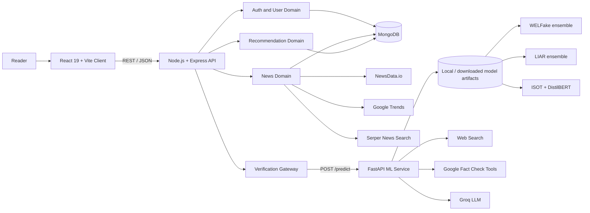
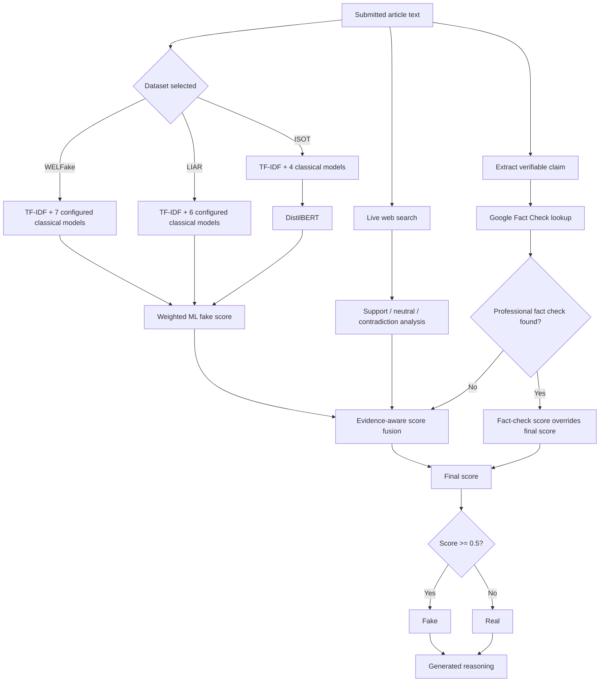
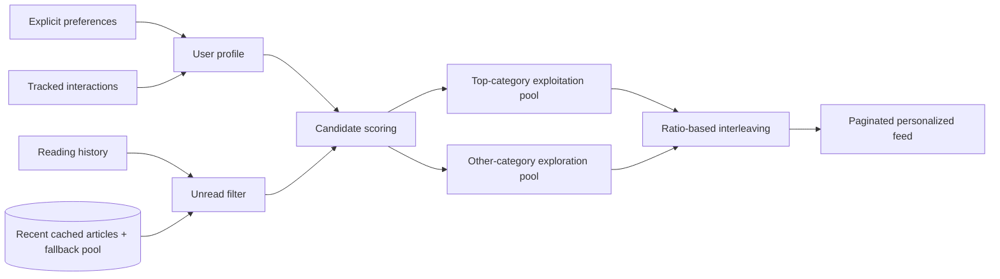
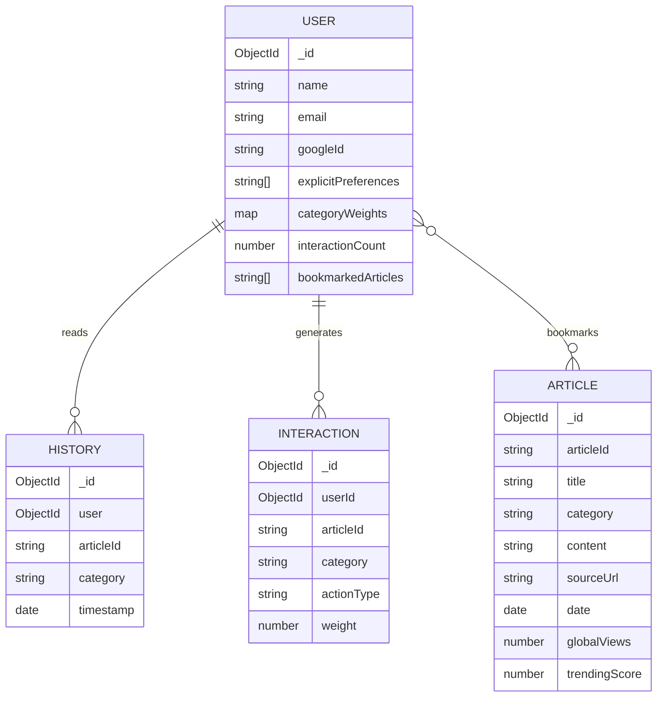
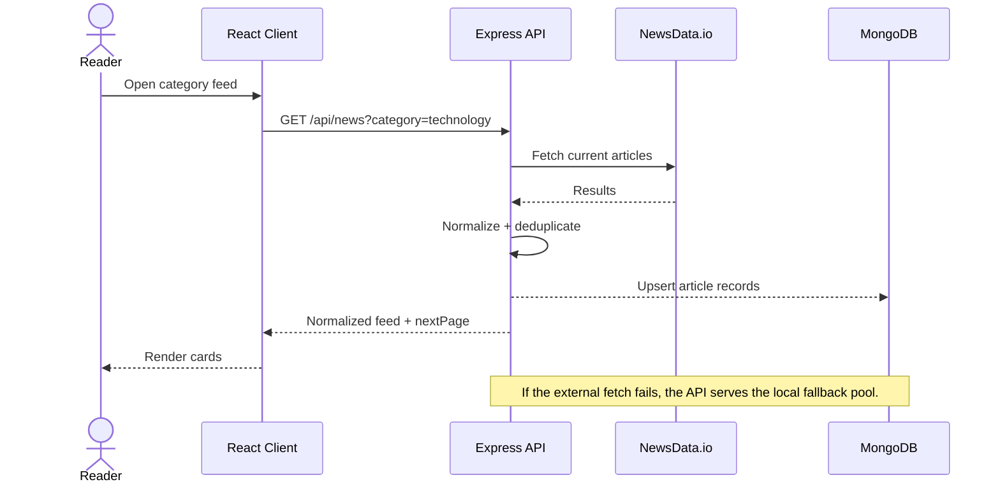
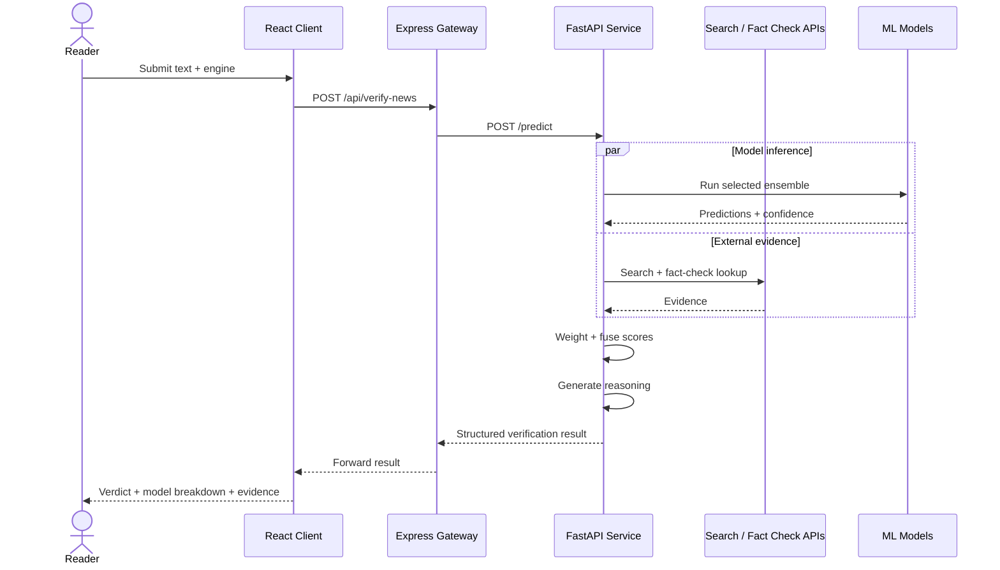

<div align="center">

# NewsPortal

### Full-stack news intelligence platform with multi-engine misinformation verification

News aggregation, personalized discovery, regional exploration, and evidence-assisted fake-news analysis across a React client, Express API, MongoDB persistence layer, and FastAPI ML service.

[Architecture](#system-architecture) · [Verification Pipeline](#verification-pipeline) · [Recommendation Engine](#recommendation-engine) · [API](#api-surface) · [Local Setup](#local-development) · [Technical Docs](#technical-documentation)


</div>

---

## What this project demonstrates

NewsPortal is a multi-service application built around a harder problem than article aggregation: **how should a consumer news product combine statistical classifiers, live web evidence, professional fact-check data, and generated explanations without treating any single signal as universally authoritative?**

The repository implements that as four cooperating subsystems:

- **News product layer:** category feeds, search, regional news, trending topics, article detail, bookmarks, reading history, and responsive navigation.
- **Personalization layer:** explicit preferences, implicit category weights, recency, popularity, and exploration versus exploitation feed mixing.
- **Verification layer:** dataset-specific ML ensembles for WELFake, LIAR, and ISOT, with DistilBERT added to the ISOT path.
- **Evidence layer:** live search, NLI-style support/contradiction analysis, Google Fact Check lookup, and generated reasoning.

The result is an engineering case study in **service decomposition, heterogeneous model orchestration, fallback design, data persistence, and explainable decision flow**.

---

## Product capabilities

| Area | Implementation |
|---|---|
| News discovery | NewsData.io-backed feeds with local fallback data and category filtering |
| Search | Server-side article/news search |
| Regional news | India state-based lookup through Serper news search |
| Trending | Google Trends integration |
| Accounts | Email/password auth, Google OAuth, JWT-protected user routes |
| Personalization | Preference and interaction-driven recommendation scoring |
| Reader state | Bookmarks, history, profile statistics, onboarding, reading insights |
| Verification | WELFake, LIAR, and ISOT inference paths with dataset-specific ensembles |
| Transformer path | Fine-tuned DistilBERT inference for ISOT when model dependencies are available |
| External evidence | Search-based verification plus Google Fact Check Tools API |
| Explanation | LLM-assisted claim extraction and verdict reasoning |
| Resilience | News fallback pool, model download/load guards, ML-service availability handling, deterministic fallbacks in several verification paths |

---

## System architecture



### Service boundaries

| Service | Responsibility | Why it is separate |
|---|---|---|
| `frontend/` | Presentation, routing, auth state, reader interactions | Keeps browser concerns independent from data and model runtime |
| `backend/` | Product API, persistence, auth, caching/fallback logic, recommendation logic | Centralizes application-domain behavior and shields the client from external APIs |
| `ml_service/` | Model loading, inference, evidence retrieval, score fusion, reasoning | Python ecosystem is better suited to scikit-learn, PyTorch, Transformers, and model artifacts |
| MongoDB | Users, articles, reading history, interactions | Persists personalization and product state across sessions |

More detail: [`docs/architecture.md`](docs/architecture.md)

---

## Verification pipeline

The verification service does not apply one universal classifier. The selected dataset chooses a different model family and label mapping, then external evidence is layered on top.



### Dataset-specific ensemble configuration

These values are **configured ensemble weights**, not automatically equivalent to measured accuracy.

| Engine | Included signals | Configured non-zero weights |
|---|---|---|
| WELFake | XGBoost, LightGBM, Random Forest, SVM, SGD, Logistic Regression; Naive Bayes loaded but weight is 0 | 25 / 25 / 20 / 15 / 10 / 5 |
| LIAR | XGBoost, Random Forest, SVM, SGD, Logistic Regression; Naive Bayes loaded but weight is 0 | 30 / 25 / 20 / 15 / 10 |
| ISOT | DistilBERT, XGBoost, LightGBM, Random Forest, Logistic Regression | 45 / 20 / 18 / 12 / 5 |

### Evidence fusion

The code normalizes the ML ensemble to a `0.0 -> 1.0` fake-probability score. Web evidence is transformed into the same direction and receives more influence when the web result is decisive. A Google Fact Check match takes priority over the blended score.

This hierarchy is important because it distinguishes:

1. **Model prior** - what trained classifiers infer from the submitted text.
2. **Live evidence** - what current web sources support or contradict.
3. **Professional fact checks** - explicit verdicts from indexed fact-checking organizations.
4. **Explanation** - an LLM-generated interpretation shown after the underlying score is computed.

The explanation is therefore not the classifier itself.

Deep dive: [`docs/verification-engine.md`](docs/verification-engine.md)

---

## Recommendation engine

The recommendation controller evolves from cold-start preferences toward interaction-driven personalization.

For each candidate article, the backend computes:

```text
score = alpha * personalization
      + beta  * popularity
      + gamma * recency
```

Where:

- **Personalization** comes from learned category weights, with explicit preferences as fallback.
- **Popularity** combines normalized trending score and global views.
- **Recency** uses exponential decay: `exp(-0.05 * hours_old)`.
- **Exploration** intentionally injects articles outside the user's strongest categories.



The exploration ratio increases as the interaction count grows, so a mature profile does not collapse into an increasingly narrow category loop.

Deep dive: [`docs/recommendation-engine.md`](docs/recommendation-engine.md)

---

## Data model



---

## Request flows

### Reading a live article



### Verifying a claim



---

## API surface

### News

| Method | Route | Purpose |
|---|---|---|
| `GET` | `/api/news` | Fetch news, optionally filtered by category and page |
| `GET` | `/api/news/search?q=` | Search articles |
| `GET` | `/api/news/region?state=` | Fetch state-specific regional news |
| `GET` | `/api/news/trending` | Fetch trending topics |
| `GET` | `/api/news/:id` | Fetch one article |

### Verification

| Method | Route | Purpose |
|---|---|---|
| `POST` | `/api/verify-news` | Validate input and forward verification request to the ML service |
| `POST` | `/predict` | Internal FastAPI inference endpoint |

### Authentication and reader state

| Method | Route | Purpose |
|---|---|---|
| `POST` | `/api/auth/register` | Register with email/password |
| `POST` | `/api/auth/login` | Authenticate with email/password |
| `POST` | `/api/auth/google` | Authenticate with Google ID token |
| `GET` | `/api/users/profile` | Fetch authenticated profile and reading statistics |
| `PUT` | `/api/users/preferences` | Update preferences |
| `GET` | `/api/users/bookmarks` | Fetch bookmarked article objects |
| `POST` | `/api/users/bookmarks` | Toggle a bookmark |
| `POST` | `/api/users/interactions` | Track an interaction used by personalization |
| `GET` | `/api/history` | Fetch authenticated reading history |
| `POST` | `/api/history` | Append reading history |
| `GET` | `/api/recommendations/:userId` | Fetch personalized article recommendations |
| `GET` | `/api/recommendations/categories/:userId` | Fetch recommended categories |

---

## Repository layout

```text
NewsPortal/
├── frontend/                 React 19 + Vite client
│   ├── src/components/       Shared UI and news components
│   ├── src/context/          Authentication state
│   ├── src/pages/            Routed product screens
│   └── src/services/         HTTP/service abstraction
├── backend/                  Node.js + Express application API
│   ├── config/               Database and CORS configuration
│   ├── controllers/          Domain logic
│   ├── middleware/           JWT authentication
│   ├── models/               Mongoose persistence models
│   └── routes/               REST route definitions
├── ml_service/               Python FastAPI inference service
│   └── app/main.py           Model loading, evidence retrieval, score fusion
├── liar_ml_models/           LIAR artifacts
├── new_models/               WELFake artifacts
├── isot_models/              ISOT artifacts when present/downloaded
├── start_all.sh              Multi-service launcher for Unix-like systems
└── start_all.bat             Multi-service launcher for Windows
```

---

## Local development

### Prerequisites

- Node.js 18+
- Python 3.9+
- MongoDB instance or Atlas cluster
- API credentials for the external services you want to enable

### 1. Install backend dependencies

```bash
cd backend
npm install
```

Create `backend/.env`:

```env
PORT=5000
MONGODB_URI=mongodb+srv://<username>:<password>@<cluster>/<database>
JWT_SECRET=replace_with_a_long_random_secret
NEWSDATA_API_KEY=your_newsdata_key
SERPER_API_KEY=your_serper_key
GOOGLE_CLIENT_ID=your_google_client_id
ML_SERVICE_URL=http://localhost:8000/predict
```

### 2. Install the ML service

```bash
cd ../ml_service
python -m venv .venv
```

Activate the virtual environment:

```bash
# macOS / Linux
source .venv/bin/activate

# Windows PowerShell
.venv\Scripts\Activate.ps1
```

Then install dependencies:

```bash
pip install -r requirements.txt
```

Create `ml_service/.env`:

```env
GROQ_API_KEY=your_groq_key
SERPER_API_KEY=your_serper_key
GOOGLE_FACT_CHECK_API_KEY=your_google_fact_check_key
```

The ML service contains startup logic that checks for required model artifacts and downloads configured assets when needed.

### 3. Install the frontend

```bash
cd ../frontend
npm install
```

Create `frontend/.env`:

```env
VITE_API_BASE_URL=http://localhost:5000
VITE_GOOGLE_CLIENT_ID=your_google_client_id
```

### 4. Start all three services

```bash
# Terminal 1
cd backend && npm start

# Terminal 2
cd ml_service && uvicorn app.main:app --reload --port 8000

# Terminal 3
cd frontend && npm run dev
```

Open `http://localhost:5173`.

The repository includes legacy `start_all.sh` and `start_all.bat` launchers, but their current environment assumptions are inconsistent. Use the three-terminal commands above unless those scripts are corrected for your platform.

---

## Engineering decisions

### Why use an Express gateway in front of FastAPI?

The browser talks to one application backend rather than coupling directly to the ML runtime. This keeps model-service location, loading behavior, and error handling out of the client and leaves room to secure or replace the model service independently.

### Why keep separate dataset engines?

WELFake, LIAR, and ISOT have different training distributions and, in this repository, different label conventions and available models. Treating them as one interchangeable classifier would hide those differences and create scoring errors.

### Why persist externally fetched articles?

Live API objects are normalized and upserted into MongoDB. That gives detail pages, bookmarks, history, and recommendations a stable object to reference after the original feed request has completed.

### Why mix exploration into recommendations?

Purely ranking by learned preference can over-specialize the feed. The controller splits candidates into exploitation and exploration pools, then interleaves them at a maturity-dependent ratio.

### Why treat generated reasoning as a downstream explanation?

The final classification score is computed before the explanation is generated. This reduces the risk of presenting free-form LLM prose as if it were the numerical decision mechanism.

---

## Failure handling and fallbacks

| Failure | Current behavior |
|---|---|
| NewsData request fails | Serve paginated local fallback news |
| Article was fetched previously | Read normalized article from MongoDB |
| ML service unavailable or starting | Express returns a service-unavailable response for upstream 5xx/refusal cases |
| Dataset vectorizer missing | FastAPI returns an explicit server error |
| Optional DistilBERT runtime unavailable | ISOT transformer inference is skipped |
| Claim extraction fails | Falls back to a sentence-based claim |
| Professional fact check not found | Uses ML + web-evidence fusion instead of fact-check override |
| User has no behavioral profile | Recommendations fall back to explicit/default categories |

---

## Security and production notes

This is a portfolio / academic-style system and should be hardened before production use.

- Secrets belong in environment variables and should never be committed.
- The current news controller contains a fallback NewsData API key in source. Remove that fallback and rotate the exposed credential before publishing or deploying the repository publicly.
- The JWT middleware contains a fallback secret. Production deployments should require `JWT_SECRET` and fail startup when it is absent.
- Recommendation routes currently accept a user ID in the URL without route-level auth middleware. For production, authorization should bind recommendations to the authenticated principal.
- The public verification endpoint should add request-size limits, rate limiting, abuse controls, and observability because it can trigger model inference plus paid external API calls.
- Generated verdict explanations should be presented as assistance, not as definitive factual adjudication.

---

## Known limitations

- The repository does not include a reproducible evaluation suite that validates end-to-end misinformation accuracy across all three engines.
- Configured ensemble weights are present in code, but calibration methodology and experiment artifacts are not documented in the repository.
- External-source quality depends on search results and third-party API availability.
- Dataset shift is a material risk: classifiers trained on one corpus may not generalize to new topics, writing styles, or adversarial content.
- The recommendation system is heuristic and category-based rather than embedding-based or collaborative-filtering based.
- The backend package currently has no automated test suite configured.

These constraints are deliberate documentation boundaries: they distinguish what the code implements from what would still need to be validated for a production misinformation product.

---

## Technical documentation

| Document | Scope |
|---|---|
| [`docs/architecture.md`](docs/architecture.md) | Service decomposition, dependency map, persistence boundaries, runtime topology |
| [`docs/verification-engine.md`](docs/verification-engine.md) | Dataset engines, model weighting, web evidence, fact-check override, failure modes |
| [`docs/recommendation-engine.md`](docs/recommendation-engine.md) | Candidate generation, ranking equation, exploration strategy, cold-start behavior |
| [`docs/presentation-guide.md`](docs/presentation-guide.md) | Suggested screenshots and demo narrative for portfolio / interview presentation |
| [`docs/adr/001-separate-ml-service.md`](docs/adr/001-separate-ml-service.md) | Architecture decision record for the Express / FastAPI service boundary |

---

## Suggested next engineering steps

1. Add unit and integration tests for auth, recommendation scoring, route validation, and verification score fusion.
2. Add an offline evaluation harness with versioned datasets and metrics for each engine.
3. Remove source-level credential fallbacks and validate required environment variables at startup.
4. Add request tracing across React -> Express -> FastAPI to make model latency and API failures observable.
5. Calibrate ensemble probabilities rather than treating raw model confidence values as directly comparable.
6. Add source-quality weighting and citation surfacing to the web-verification result.
7. Containerize all services with a single local orchestration file for reproducible setup.

---

<div align="center">

### Built as a systems project, documented as an engineering case study

Existing repository attribution: [Utkarsh Yadav](https://github.com/utkrshydv)

</div>
