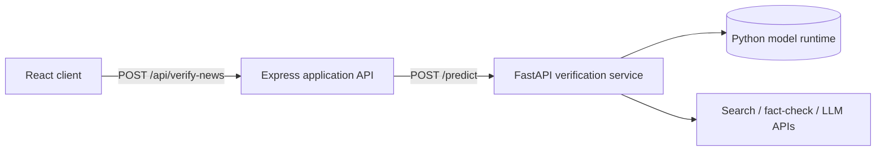

# ADR 001: Separate ML Inference from the Application API

**Status:** Implemented

---

## Context

NewsPortal needs both conventional web-application capabilities and Python-native machine-learning capabilities.

The application layer needs:

- Authentication and authorization.
- MongoDB persistence.
- News aggregation and normalization.
- Reader history and bookmarks.
- Recommendation ranking.
- A stable REST API for the browser.

The verification layer needs:

- scikit-learn model artifacts.
- XGBoost and LightGBM runtimes.
- PyTorch and Hugging Face Transformers.
- Model initialization at service startup.
- Search/fact-check orchestration tied to inference.

Putting all of this in one runtime would either force the application API into Python or force ML execution behind awkward cross-language process boundaries inside Node.

---

## Decision

Use two backend services:

- **Express application API:** owns product-domain behavior and browser-facing routes.
- **FastAPI verification service:** owns model lifecycle and verification computation.

The Express `verifyController` acts as a gateway and forwards validated verification requests to FastAPI.

---

## Consequences

### Positive

- Python ML dependencies remain isolated from the Node application runtime.
- The browser does not need to know where the model service is deployed.
- Model startup/cold-start failures can be translated into application-level errors by Express.
- The ML service can be scaled independently if inference becomes the bottleneck.
- The product API can evolve independently from model implementation details.

### Negative

- Every verification request adds a network hop.
- Deployment now has multiple services to configure and observe.
- Cross-service errors require consistent timeouts and tracing.
- Local development needs three processes rather than two.

---

## Alternatives considered

### Run ML directly inside Node

Rejected for this implementation because the trained artifacts and inference libraries are Python-centric.

### Move the entire backend to FastAPI

Plausible, but it would require rewriting the existing Express/Mongoose application domain. The current separation preserves working Node product logic while isolating the ML-specific runtime.

### Invoke a Python subprocess from Express

Rejected as a service architecture because process lifecycle, concurrency, model loading, and failure isolation become harder to manage than a long-running inference service.

---

## Follow-up work

- Add explicit connect/read timeouts for the Express -> FastAPI call.
- Add correlation IDs propagated across both services.
- Add health/readiness endpoints that distinguish process health from model readiness.
- Add rate limiting around the browser-facing verification route.
- Containerize both services for reproducible local orchestration.
