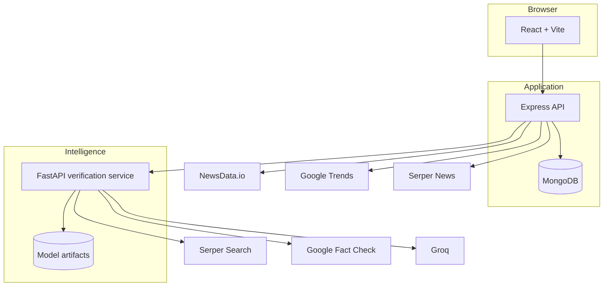
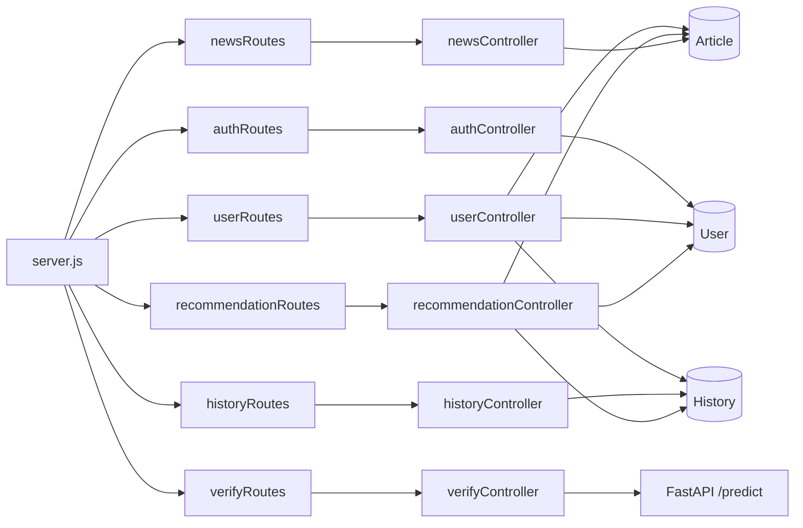
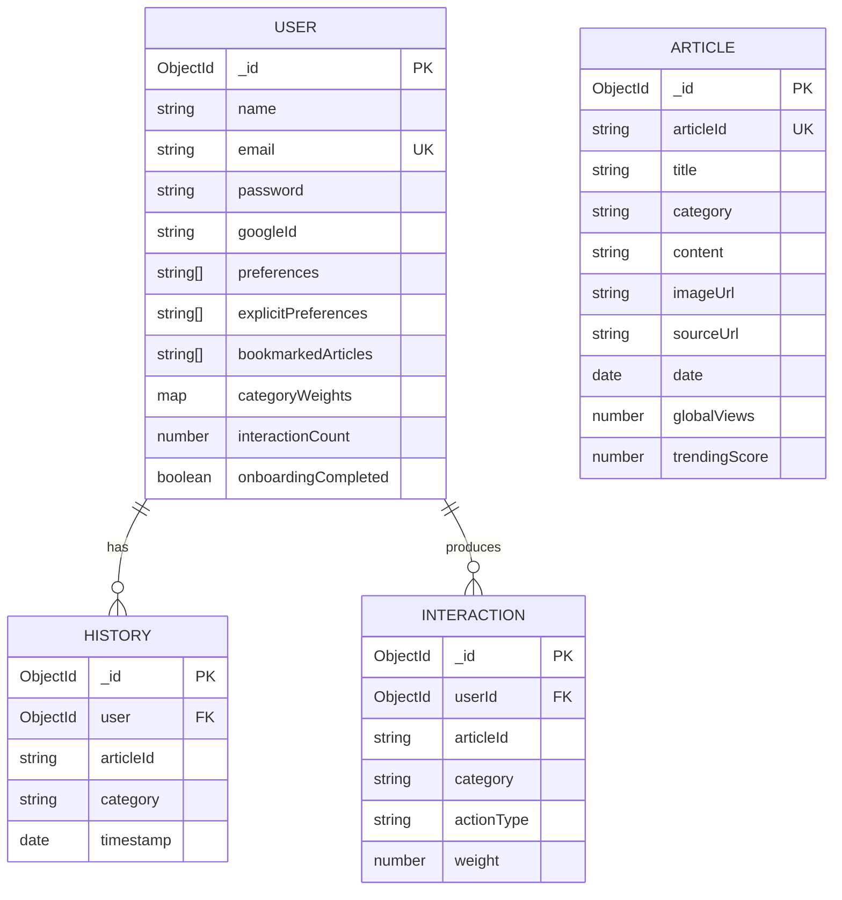
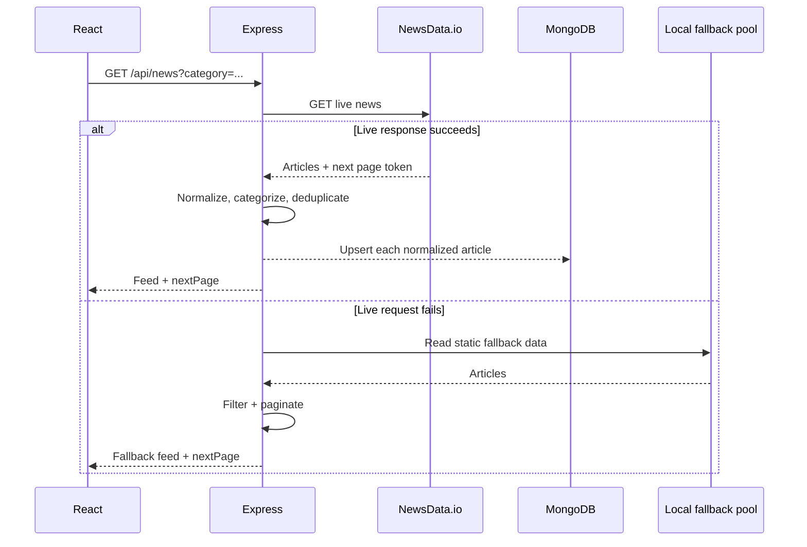
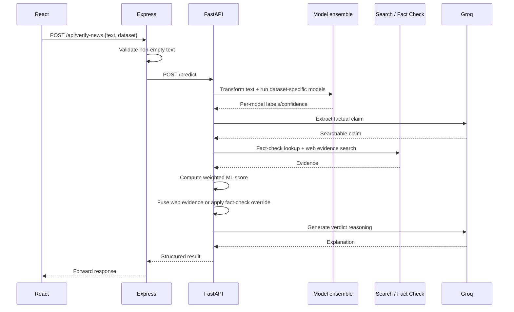
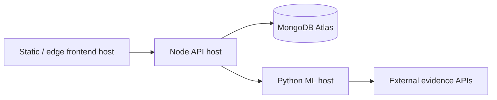

# NewsPortal Architecture

### Runtime boundaries, dependency flow, persistence, and service responsibilities

---

## Architectural goals visible in the implementation

The repository separates product-domain logic from model-runtime logic instead of treating the application as one monolith. That separation is the most important architectural choice in the codebase.

The system has three execution environments:

1. **Browser:** React renders the product and manages user interaction.
2. **Application API:** Express owns product state, authentication, external news access, and recommendation logic.
3. **Inference API:** FastAPI owns Python ML dependencies, model artifacts, web evidence retrieval, and verification score fusion.

MongoDB is shared by the application domains that require persistence.

---

## Container view

---

## Backend domain map

### Why this matters

The backend is not only a proxy. It owns several domain rules:

- News response normalization and de-duplication.
- Persistence of external news into a stable local schema.
- JWT authentication and Google identity handling.
- Bookmark/history/profile behavior.
- Recommendation candidate selection and ranking.
- Error translation when the ML service is unavailable.

This means moving the entire backend into the frontend would lose a meaningful application boundary.

---

## Persistence model

### Article caching strategy

When the live news API returns an article, the backend normalizes it and asynchronously upserts it into the `Article` collection. This turns an ephemeral third-party response into an object that later flows can resolve for:

- Article details.
- Bookmarks.
- Recommendation candidate pools.
- User history-related views.

The strategy is simple, but it addresses a common integration problem: external IDs and article payloads may not remain available through the same feed call later.

---

## Runtime sequence: feed request

---

## Runtime sequence: verification request

---

## Reliability boundaries

### Existing resilience mechanisms

- External news failures route to local data.
- Article details can resolve from persisted live articles.
- ML startup checks attempt to load/download artifacts.
- DistilBERT can be skipped if its runtime is unavailable.
- Claim extraction has a sentence-based fallback.
- Missing professional fact checks do not stop classification.
- Express converts upstream ML refusal/5xx behavior into a user-facing service-unavailable response.

### Gaps for a production architecture

- No distributed tracing across the three services.
- No queue or bulkhead around expensive verification calls.
- No explicit API rate-limiting layer.
- No startup schema validating all required environment variables.
- Recommendation endpoints are not consistently authorized by authenticated identity.
- No automated dependency health checks beyond simple root health routes.
- No test harness visible in `backend/package.json`.

---

## Deployment topology

The code supports independent deployment of the three runtime components.

This is a sensible topology for a portfolio project because the Python model runtime can scale and cold-start independently from the product API. The tradeoff is additional network latency and operational complexity.

---

## Architecture review summary

**Strongest design choice:** separating Python inference from the Node product API.

**Most important data design choice:** persisting normalized live articles so downstream reader features do not depend on re-fetching the exact third-party object.

**Most important production gap:** security and observability around expensive public verification calls.

**Most important ML-systems gap:** no checked-in experiment/evaluation artifact that demonstrates calibration or end-to-end accuracy of the score-fusion strategy.
