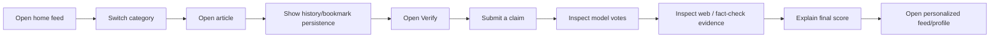

<div align="center">

# Project Presentation Guide

### How to present NewsPortal as an engineering project in a portfolio, interview, or repository review

</div>

---

## Recommended narrative

Do not present this project as "a fake-news detector with seven models." That framing hides the strongest engineering work and overstates uniformity across the engines.

A better 60-second story is:

> NewsPortal is a three-service news intelligence application. The React client handles discovery and verification UX, an Express API owns product state and personalization, and a FastAPI service runs dataset-specific misinformation ensembles. The verification flow combines trained classifiers with live web evidence and professional fact-check results, while the recommendation flow balances learned category preferences with recency, popularity, and exploration.

---

## Portfolio screenshot set

Add these images under `docs/assets/` when you have the application running.

| File | What to capture | Why it matters |
|---|---|---|
| `01-home-feed.png` | Desktop home feed with category navigation | Establishes product completeness |
| `02-verify-input.png` | Verification screen before submission | Shows primary AI workflow |
| `03-verify-result.png` | Verdict, model breakdown, web evidence, reasoning | Highest-value technical screenshot |
| `04-regional-map.png` | Interactive India regional-news experience | Shows non-trivial visualization / discovery UX |
| `05-profile-insights.png` | Profile or reading insights | Connects persistence to user value |
| `06-mobile-home.png` | Mobile layout | Demonstrates responsive product work |

Use real screenshots. Do not replace them with mock dashboards or generated UI images.

---

## Suggested README hero after screenshots exist

Place the main verification result screenshot immediately after the opening project summary:

```html
<p align="center">
  
</p>
```

Then add a two-image product strip for the feed and regional map.

---

## Interview deep-dive order

### 1. Start with the service boundary

Explain why the project uses React + Express + FastAPI rather than putting everything in one Node process.

Key point: Python inference dependencies and model lifecycle are isolated from product-domain API logic.

### 2. Explain the class-label problem

WELFake does not use the same integer-to-label convention as LIAR/ISOT. Show that the inference service normalizes labels before weighted aggregation.

This is a good engineering detail because it demonstrates awareness of a subtle failure mode that can silently invert predictions.

### 3. Explain evidence hierarchy

Walk through:

1. Dataset-specific ML prior.
2. Live search evidence.
3. Professional fact-check override when available.
4. Generated explanation after scoring.

This is stronger than saying "the LLM detects fake news."

### 4. Explain personalization as a ranking system

Show the scoring formula and the exploration ratio. Point out that the system increases personalization and exploration together as more interaction data becomes available.

### 5. Finish with limitations

A strong technical presentation should explicitly say the repository does not yet contain end-to-end calibration/evaluation artifacts. Then explain how you would add an evaluation harness, ablation testing, request tracing, and security controls.

That demonstrates engineering judgment rather than only feature breadth.

---

## Demo flow

A five-minute demo can follow this order:



Keep the verification result as the centerpiece. The rest of the product proves that it is a complete application around the ML workflow.

---

## Claims to avoid unless you add evidence

Avoid these in the README, resume, or interview unless you have reproducible evaluation outputs:

- "95% accurate fake-news detection."
- "Production-grade misinformation classifier."
- "Seven models run for every engine."
- "The web layer verifies truth."
- "The LLM determines the final verdict."

Prefer precise implementation language:

- "Dataset-specific weighted ensembles."
- "Live evidence retrieval and support/contradiction analysis."
- "Google Fact Check result can override the blended score."
- "Generated reasoning is downstream of score computation."
- "Configured model weights are implementation choices pending calibration/evaluation."

---

## What to add next for stronger presentation

1. Real UI screenshots.
2. A 60-90 second demo GIF or short video linked from the README.
3. A small benchmark table generated from a reproducible evaluation script.
4. A latency breakdown for model inference, web verification, and total request time.
5. One architecture decision record explaining the Node/FastAPI split.
6. A test badge only after CI actually runs meaningful tests.
