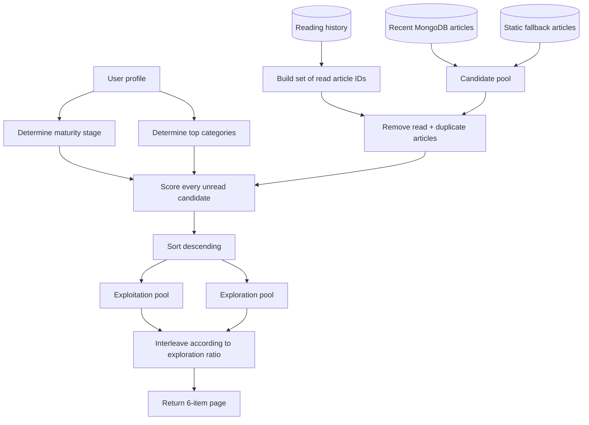
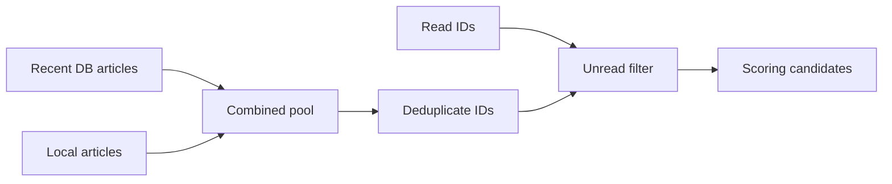
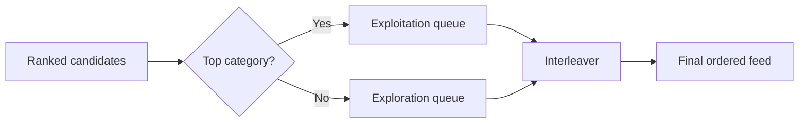
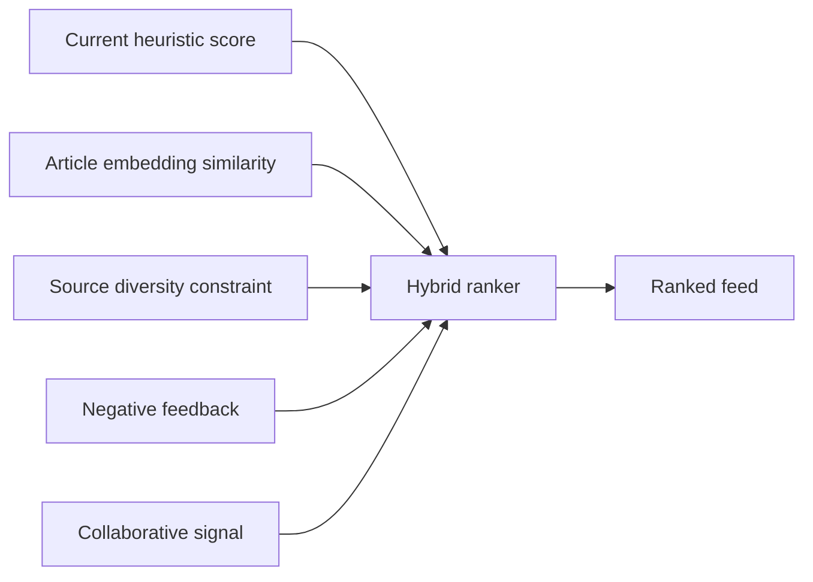

<div align="center">

# Recommendation Engine

### Preference learning, candidate scoring, and exploration versus exploitation

</div>

---

## Objective

The recommendation controller produces a personalized unread feed using information already available in the product:

- Explicit onboarding/preferences.
- Learned category weights.
- Interaction count.
- Reading history.
- Article popularity indicators.
- Article age.

The design is intentionally lightweight and explainable rather than using embeddings or collaborative filtering.

---

## Pipeline



---

## Maturity stages

The recommendation weights change as interaction data accumulates.

| User state | Condition | Personalization `alpha` | Popularity `beta` | Recency `gamma` | Exploration ratio |
|---|---:|---:|---:|---:|---:|
| Cold start | 0 interactions | 0.60 | 0.30 | 0.10 | 0.10 |
| Early | 1-10 | 0.65 | 0.20 | 0.15 | 0.10 |
| Learning | 11-50 | 0.75 | 0.10 | 0.15 | 0.20 |
| Mature | 51+ | 0.80 | 0.05 | 0.15 | 0.25 |

The implementation increasingly trusts the user's learned preferences while also increasing deliberate exploration.

That combination is notable: stronger personalization does not mean less diversity in the feed.

---

## Candidate generation

The controller combines:

1. Up to 300 recent `Article` records from MongoDB.
2. The repository's static news fallback pool.

It then removes:

- Anything already present in reading history.
- Duplicate IDs across the DB and fallback pools.



---

## Ranking equation

For each unread article:

```text
finalScore = alpha * pScore
           + beta  * popScore
           + gamma * recencyScore
```

### Personalization score

Priority order:

1. Learned `categoryWeights[article.category]`.
2. Explicit preference match, scored as `1.0`.
3. Default value `0.1`.

### Popularity score

The controller combines trending and view information, capped at `1.0`:

```text
popScore = min(
    trendingScore / 100 + globalViews / 1000,
    1.0
)
```

### Recency score

```text
hoursOld = max((now - articleDate) / 3600000, 0)
recencyScore = exp(-0.05 * hoursOld)
```

This gives a smooth decay rather than a hard freshness cutoff.

---

## Exploration versus exploitation

After ranking, articles are split into two pools:

- **Exploitation:** article category is one of the user's top categories.
- **Exploration:** article category is outside the user's top categories.

The controller inserts exploration items every `round(1 / explorationRatio)` positions when possible.

Example:

```text
explorationRatio = 0.20
frequency = round(1 / 0.20) = 5
```

That approximates one exploration article every five positions.



---

## Cold-start behavior

If learned category weights are unavailable, the controller falls back in this order:

1. Explicit preferences.
2. Default categories: `Technology` and `Business` for top-category selection.

The separate recommended-category endpoint also merges:

- Explicit preferences.
- Legacy preferences.
- Most-read categories from history.

If none exist, it returns `Technology`, `Business`, and `Science`.

---

## Pagination

The final mixed feed is paginated after scoring and interleaving:

- Page size: 6.
- `nextPage` is returned as a string when additional results remain.
- Pagination therefore preserves the ranking/diversity order of the fully organized feed.

---

## Strengths

- Explainable scoring formula.
- Explicit cold-start behavior.
- Excludes already-read content.
- Uses both persisted live articles and fallback content.
- Includes diversity through exploration rather than pure top-score sorting.
- Adjusts ranking strategy based on user maturity.

---

## Limitations

- Category preferences are coarse and cannot capture semantic similarity within a category.
- Popularity normalization constants are hard-coded.
- Interaction-based `categoryWeights` are not calibrated against explicit negative feedback in this controller.
- No collaborative signal from similar users.
- No content embeddings, topic vectors, or source diversity constraint.
- Feed ranking is recomputed in application memory rather than delegated to a ranking/index service.
- The route accepts a `userId` parameter directly and should be authorization-bound for production use.

---

## Natural evolution path

A technically stronger second-generation recommender could retain the current transparent heuristic as a baseline and add:



The baseline should remain measurable so each added signal can be evaluated through offline ranking metrics and controlled product experiments.
