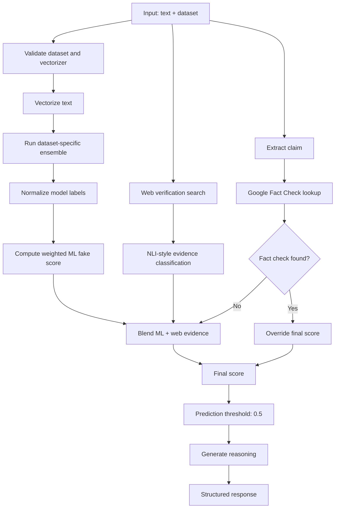
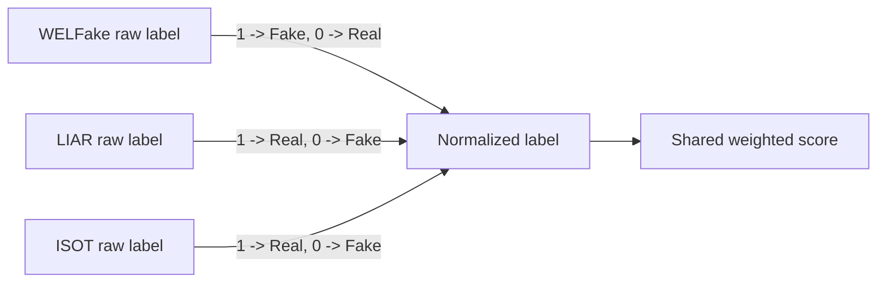
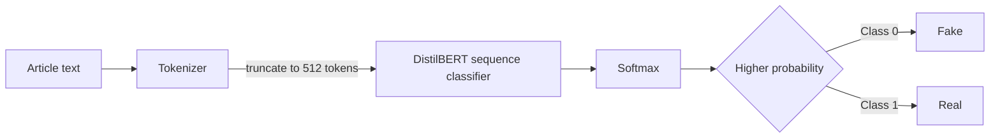
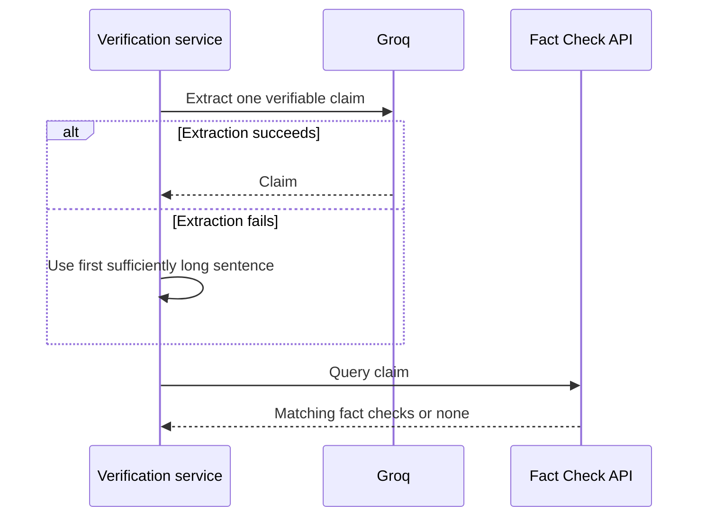
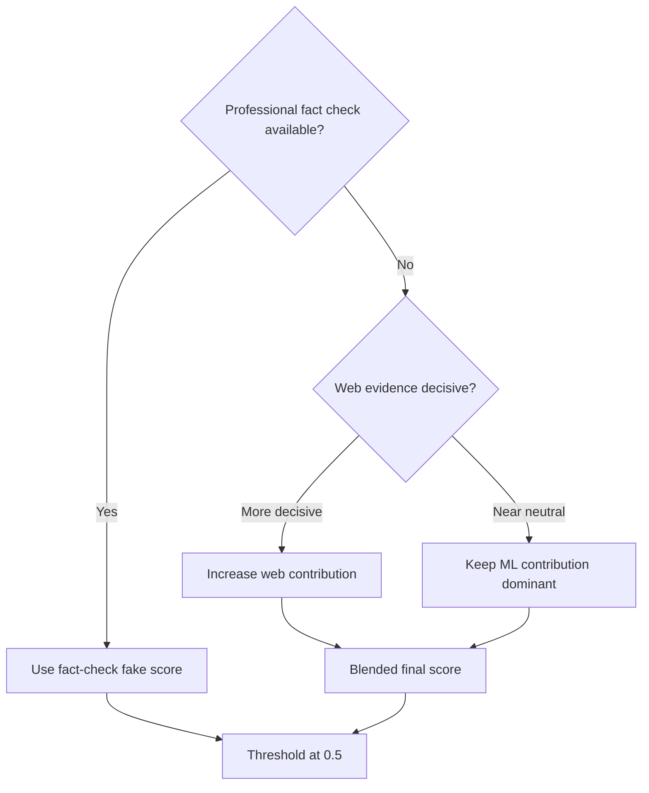

<div align="center">

# Verification Engine

### Dataset-specific ensembles, live evidence, fact-check priority, and score fusion

</div>

---

## Purpose

The verification subsystem is designed as an **evidence-fusion pipeline**, not a single binary classifier.

Its output contains:

- Individual model predictions.
- Individual confidence values where available.
- A weighted ML consensus score.
- A live web-verification result.
- Optional professional fact-check metadata.
- A final real/fake classification.
- Generated reasoning for the UI.

---

## Top-level control flow



---

## Engine selection

The `dataset` field is normalized to lowercase and must exist in the loaded vectorizer map. Each engine has its own label convention and weight table.

### WELFake

Configured models:

| Model | Weight |
|---|---:|
| XGBoost | 25 |
| LightGBM | 25 |
| Random Forest | 20 |
| SVM | 15 |
| SGD | 10 |
| Logistic Regression | 5 |
| Naive Bayes | 0 |

Label convention in code: `1 = Fake`, `0 = Real`.

### LIAR

Configured models:

| Model | Weight |
|---|---:|
| XGBoost | 30 |
| Random Forest | 25 |
| SVM | 20 |
| SGD | 15 |
| Logistic Regression | 10 |
| Naive Bayes | 0 |

LightGBM is explicitly excluded because the repository does not contain a trained LIAR LightGBM model.

Label convention in code: `1 = Real`, `0 = Fake`.

### ISOT

Configured models:

| Model | Weight |
|---|---:|
| DistilBERT | 45 |
| XGBoost | 20 |
| LightGBM | 18 |
| Random Forest | 12 |
| Logistic Regression | 5 |

Label convention in code: `1 = Real`, `0 = Fake` for the classical models. The DistilBERT path maps transformer class probabilities to Real/Fake separately.

---

## Why label normalization is necessary

The three training pipelines do not share a uniform class encoding. The inference service explicitly maps each dataset's integer prediction into a common `Real` / `Fake` representation before aggregation.

Without that normalization, an ensemble refactor could accidentally interpret `1` as Fake in one dataset and Real in another.



---

## ML consensus calculation

The service accumulates only models with non-zero configured weights.

```text
ml_score = fake_model_weight / total_active_model_weight
```

Interpretation:

- `0.0` means all weighted model votes are Real.
- `1.0` means all weighted model votes are Fake.
- `0.5` is the final classification threshold after evidence fusion.

A key technical nuance: model confidence values are returned to the UI, but the ensemble score itself is based on **weighted labels**, not a calibrated weighted average of each model's probability.

That makes the weights easy to reason about, but probability calibration remains an important future improvement.

---

## DistilBERT path

ISOT adds a transformer signal when `torch` and `transformers` are available and model loading succeeds.



If the runtime dependencies are unavailable, the service logs that DistilBERT is skipped rather than failing all inference.

---

## Professional fact-check path

The service first attempts to extract one specific, searchable factual claim. It then queries the Google Fact Check Tools API.



If a professional fact-check result is found, its mapped fake score becomes the final score. The web-verification payload is still retained for UI visibility.

This creates an explicit evidence hierarchy rather than simply averaging all signals.

---

## Web evidence path

The web-verification function searches current web results and uses LLM-assisted reasoning to characterize evidence as support, contradiction, or neutral context.

The returned web score is interpreted as:

- Higher score: stronger support for the submitted claim.
- Lower score: stronger contradiction.
- Mid-range score: neutral or inconclusive evidence.

The service converts that into a fake-direction score:

```text
web_fake_score = 1 - (web_score / 100)
```

It then derives a decisiveness term:

```text
neutrality = abs(web_fake_score - 0.5) * 2
web_weight = 0.7 * neutrality
ml_weight = 1 - web_weight
```

Despite the variable name `neutrality`, the computed value is actually closer to **decisiveness distance from neutral**. A score near 0.5 gives the web path little influence; a score near 0 or 1 gives it more influence.

The blended score is:

```text
nli_final_score = web_weight * web_fake_score
                + ml_weight  * ml_score
```

---

## Decision hierarchy



This hierarchy is more defensible than treating all sources as equal, but the numeric mapping from fact-check labels and evidence classes should still be validated empirically.

---

## Response contract

The FastAPI endpoint returns a structure equivalent to:

```json
{
  "results": {
    "xgboost": {
      "prediction": "Real",
      "confidence": 87
    }
  },
  "web_verification": {},
  "analysis": "Generated explanation",
  "weighted_consensus": {
    "prediction": "Real",
    "ml_score": 0.31,
    "web_adjustment": -0.08,
    "final_score": 0.23,
    "weights_used": {
      "xgboost": 25
    }
  }
}
```

The example values above illustrate the shape only. They are not benchmark results from the repository.

---

## Failure modes

| Condition | Behavior |
|---|---|
| Unknown dataset | HTTP 400 |
| Vectorizer missing | HTTP 500 |
| One optional model fails to load | Load path logs failure; other available models can still exist |
| DistilBERT dependencies unavailable | Transformer path is skipped |
| Claim extraction fails | Sentence-based fallback claim |
| Fact-check API returns no match | Continue with ML + web fusion |
| Web evidence is neutral | ML score retains more influence |
| Express cannot reach ML service | Gateway returns service-unavailable behavior for refusal/upstream 5xx cases |

---

## Evaluation gaps

The source code supports the architecture above, but the repository does **not** contain a complete reproducible benchmark package for the end-to-end decision system.

A stronger evaluation design would include:

1. Held-out test sets per dataset with frozen versions.
2. Precision, recall, F1, ROC-AUC, and calibration metrics per model.
3. Confusion matrices by topic and source.
4. Ablation tests for ML-only, web-only, fact-check-only, and fused variants.
5. Expected calibration error before and after probability calibration.
6. Latency distributions for each external evidence dependency.
7. Adversarial tests for paraphrase, quotation, satire, and mixed true/false claims.

Until those artifacts exist, the configured weights should be described as **implementation choices**, not demonstrated optimal weights.
